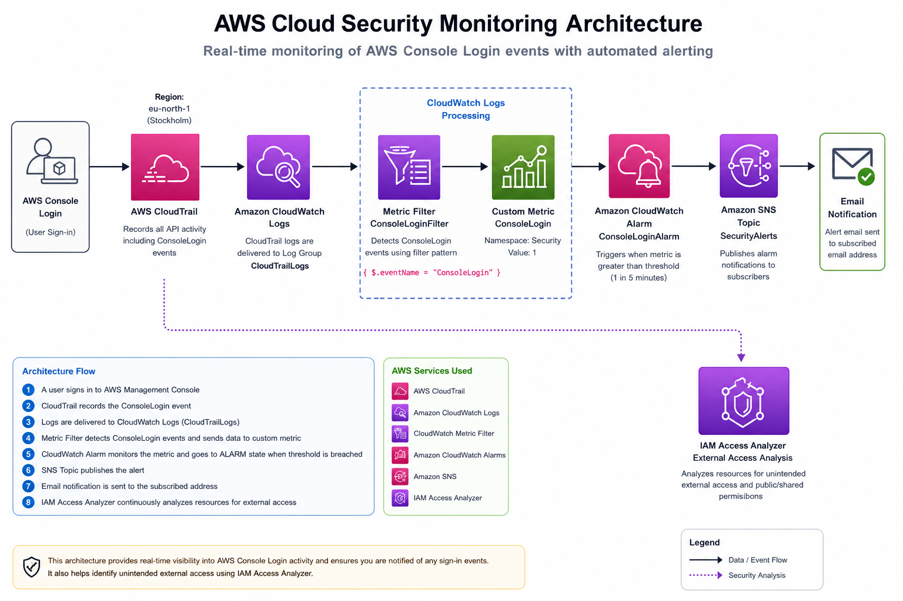
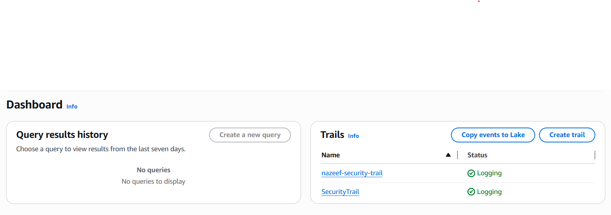
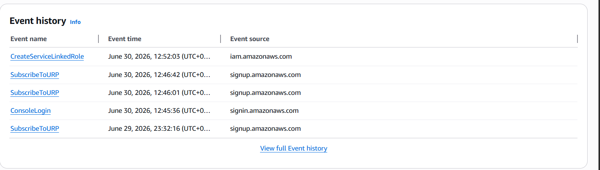
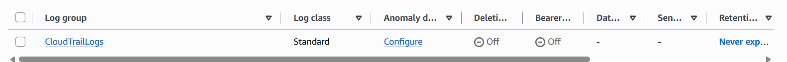
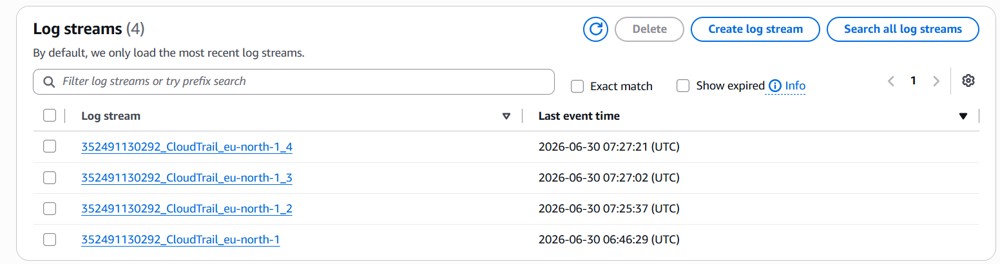
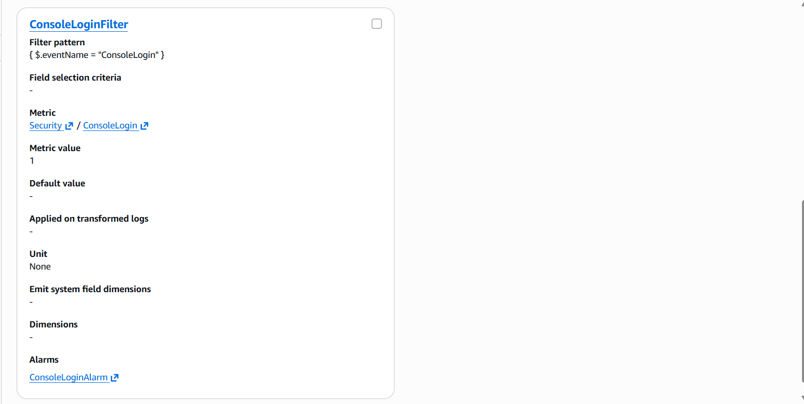
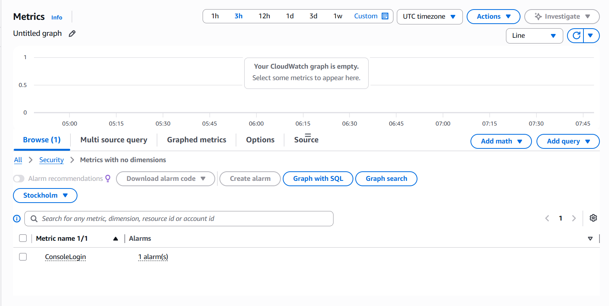
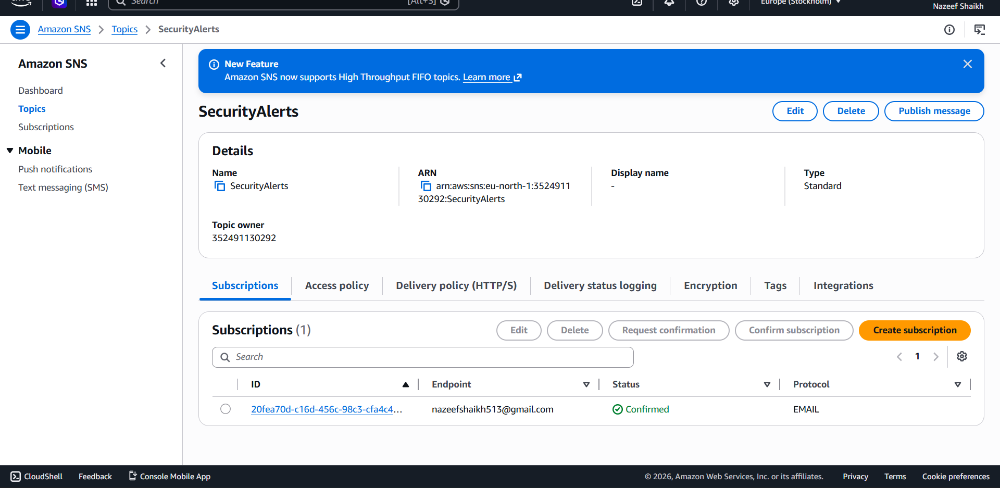
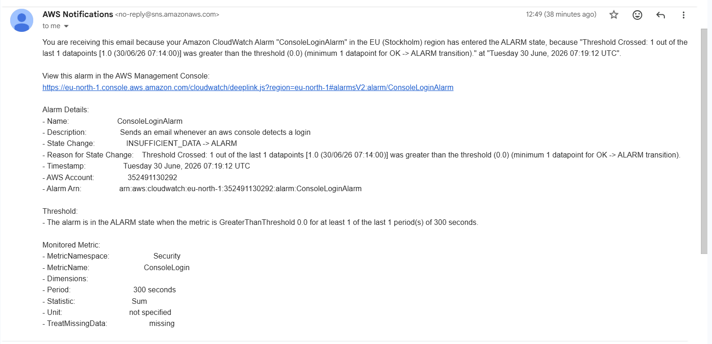
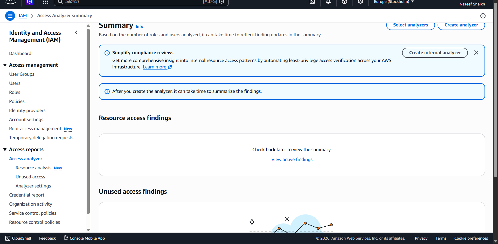

# ☁️ AWS Cloud Security Monitoring Lab

<p align="center">


</p>

---

## 📖 Project Overview

This project demonstrates the implementation of an end-to-end AWS cloud security monitoring solution using native AWS security and monitoring services.

The solution captures AWS Console Login events using AWS CloudTrail, forwards logs to Amazon CloudWatch Logs, detects login activity using Metric Filters, triggers CloudWatch Alarms, and sends real-time email notifications through Amazon SNS. Additionally, IAM Access Analyzer is configured to monitor resources for unintended external access.

This project simulates how organizations monitor AWS account activity and automate security alerting for critical management events.

---

## 🎯 Objectives

- Monitor AWS Console Login activity.
- Capture API events using AWS CloudTrail.
- Store logs in Amazon CloudWatch Logs.
- Detect login events using Metric Filters.
- Generate custom CloudWatch Metrics.
- Trigger CloudWatch Alarms automatically.
- Send real-time email alerts using Amazon SNS.
- Analyze external resource access using IAM Access Analyzer.
- Demonstrate an end-to-end cloud security monitoring workflow.

---

## 🏗️ Architecture

<p align="center">

</p>

---
## 📑 Table of Contents

- [Project Overview](#-project-overview)
- [Objectives](#-objectives)
- [Architecture](#-architecture)
- [AWS Services Used](#-aws-services-used)
- [Security Workflow](#-security-workflow)
- [Repository Structure](#-repository-structure)
- [Implementation Steps](#-implementation-steps)
- [Screenshots](#-screenshots)
- [Testing & Validation](#-testing--validation)
- [Key Learning Outcomes](#-key-learning-outcomes)
- [Skills Demonstrated](#-skills-demonstrated)
- [Future Improvements](#-future-improvements)

## ⚙️ AWS Services Used

| Service | Purpose |
|----------|----------|
| AWS CloudTrail | Captures AWS API and Console Login events |
| Amazon CloudWatch Logs | Stores CloudTrail logs |
| CloudWatch Metric Filters | Detects ConsoleLogin events |
| CloudWatch Metrics | Generates custom security metrics |
| CloudWatch Alarms | Monitors security metrics |
| Amazon SNS | Sends email notifications |
| IAM Access Analyzer | Detects unintended external resource access |

---

---

# 🔄 Security Workflow

The monitoring solution follows an event-driven security workflow to detect AWS Console Login activity and generate automated notifications.

```text
AWS Console Login
        │
        ▼
AWS CloudTrail records the event
        │
        ▼
CloudTrail Logs → Amazon CloudWatch Logs
        │
        ▼
Metric Filter detects "ConsoleLogin"
        │
        ▼
Custom Metric (ConsoleLogin)
        │
        ▼
CloudWatch Alarm evaluates threshold
        │
        ▼
Amazon SNS publishes notification
        │
        ▼
Email Alert sent to administrator

IAM Access Analyzer continuously monitors AWS resources for unintended external access.
```

---

# 📂 Repository Structure

```text
aws-cloud-security-monitoring-lab/
│
├── README.md
├── LICENSE
│
├── architecture/
│   └── architecture.png
│
├── documentation/
│   ├── project-overview.md
│   ├── setup-guide.md
│   └── testing-validation.md
│
└── screenshots/
    ├── 01-cloudtrail-trail.png
    ├── 02-cloudtrail-event-history.png
    ├── 03-cloudwatch-log-group.png
    ├── 04-cloudwatch-log-streams.png
    ├── 05-consolelogin-metric-filter.png
    ├── 06-consolelogin-alarm.png
    ├── 07-sns-topic.png
    ├── 08-email-alert.png
    └── 09-iam-access-analyzer.png
```

---

# 🛠️ Implementation Steps

## Step 1 – Configure AWS CloudTrail

- Created a multi-region CloudTrail.
- Enabled management event logging.
- Configured an Amazon S3 bucket for log storage.
- Integrated CloudTrail with Amazon CloudWatch Logs.

---

## Step 2 – Configure CloudWatch Logs

- Created the **CloudTrailLogs** log group.
- Verified log streams were generated.
- Confirmed CloudTrail events were successfully delivered.

---

## Step 3 – Create Metric Filter

Created a metric filter with the following pattern:

```json
{ $.eventName = "ConsoleLogin" }
```

Configuration:

- Namespace: **Security**
- Metric Name: **ConsoleLogin**
- Metric Value: **1**

---

## Step 4 – Configure CloudWatch Alarm

Created an alarm using the custom metric.

Configuration:

- Metric: **ConsoleLogin**
- Threshold: **Greater than 0**
- Evaluation Period: **1**
- Period: **5 Minutes**

Whenever a Console Login event occurs, the alarm transitions to the **ALARM** state.

---

## Step 5 – Configure Amazon SNS

- Created SNS Topic **SecurityAlerts**
- Added email subscription
- Confirmed subscription
- Connected CloudWatch Alarm to SNS

Result:

Whenever the alarm enters the ALARM state, an email notification is sent automatically.

---

## Step 6 – Configure IAM Access Analyzer

Configured IAM Access Analyzer to monitor the AWS account for unintended external access.

During testing, no active findings were reported, indicating no externally accessible resources were detected.

---

# 📸 Screenshots

## CloudTrail Configuration

CloudTrail configured for multi-region logging.



---

## CloudTrail Event History

Captured AWS API activity including management events.



---

## CloudWatch Log Group

CloudTrail logs delivered to CloudWatch Logs.



---

## CloudWatch Log Streams

Generated log streams confirming successful log ingestion.



---

## Metric Filter

Metric Filter configured to detect Console Login events.



---

## CloudWatch Alarm

CloudWatch Alarm configured to monitor Console Login activity.



---

## Amazon SNS Topic

SNS Topic configured for security notifications.



---

## Email Notification

Real-time email notification generated after a successful Console Login event.



---

## IAM Access Analyzer

Analyzer configured to monitor AWS resources for unintended external access.



---

# 🧪 Testing & Validation

The monitoring pipeline was validated by generating AWS Console Login events.

## Test Scenario

1. Logged into the AWS Management Console.
2. Verified CloudTrail recorded the ConsoleLogin event.
3. Confirmed CloudTrail delivered logs to CloudWatch Logs.
4. Verified Metric Filter generated the custom metric.
5. Confirmed CloudWatch Alarm entered the ALARM state.
6. Verified Amazon SNS sent an email notification.
7. Confirmed IAM Access Analyzer was enabled and monitoring resources.

---
## ✨ Features

- Multi-region AWS CloudTrail logging
- Centralized log management with CloudWatch Logs
- Real-time detection of AWS Console Login events
- Custom CloudWatch Metric Filters
- Automated CloudWatch Alarms
- Email notifications via Amazon SNS
- IAM Access Analyzer for external access assessment
- Professional documentation with architecture diagrams and validation
## Validation Results

| Component | Status |
|-----------|--------|
| CloudTrail Logging | ✅ Success |
| CloudWatch Logs | ✅ Success |
| Metric Filter | ✅ Success |
| Custom Metric | ✅ Success |
| CloudWatch Alarm | ✅ Success |
| Amazon SNS Notification | ✅ Success |
| Email Alert | ✅ Success |
| IAM Access Analyzer | ✅ Enabled |

---

# 📚 Key Learning Outcomes

This project provided practical experience with:

- AWS security monitoring architecture
- AWS CloudTrail event logging
- Amazon CloudWatch Logs
- CloudWatch Metric Filters
- Custom CloudWatch Metrics
- CloudWatch Alarm configuration
- Amazon SNS notifications
- IAM Access Analyzer
- Event-driven security monitoring
- Cloud security best practices
- Monitoring AWS Management Console activity
- Building automated alerting pipelines

---

# 💼 Skills Demonstrated

- AWS Cloud Security
- Cloud Monitoring
- Security Event Detection
- Log Management
- Event Correlation
- Security Alerting
- IAM Security
- AWS Identity & Access Management
- Amazon CloudWatch
- AWS CloudTrail
- Amazon SNS
- Incident Monitoring
- Security Operations (SOC)
- Cloud Infrastructure Monitoring

---

# 🚀 Future Improvements

Possible enhancements include:

- Integrate AWS Security Hub for centralized security findings.
- Enable Amazon GuardDuty for intelligent threat detection.
- Configure AWS Config Rules for compliance monitoring.
- Monitor additional CloudTrail events such as:
  - Root account usage
  - IAM policy changes
  - Security Group modifications
  - Unauthorized API calls
  - Console login failures
- Forward CloudWatch Logs to Amazon OpenSearch for advanced log analytics.
- Integrate AWS Lambda for automated incident response.
- Build a CloudWatch Dashboard to visualize security metrics.
- Implement AWS Systems Manager Automation for remediation workflows.

---


# 👨‍💻 Author

**Nazeef Shaikh**

If you found this project helpful, feel free to ⭐ this repository.

This project was created for learning, portfolio development, and demonstrating practical AWS Cloud Security Monitoring concepts.

## 📚 Documentation

For detailed implementation guides:

- 📄 [Project Overview](documentation/project-overview.md)
- ⚙️ [Setup Guide](documentation/setup-guide.md)
- 🧪 [Testing & Validation](documentation/testing-validation.md)

